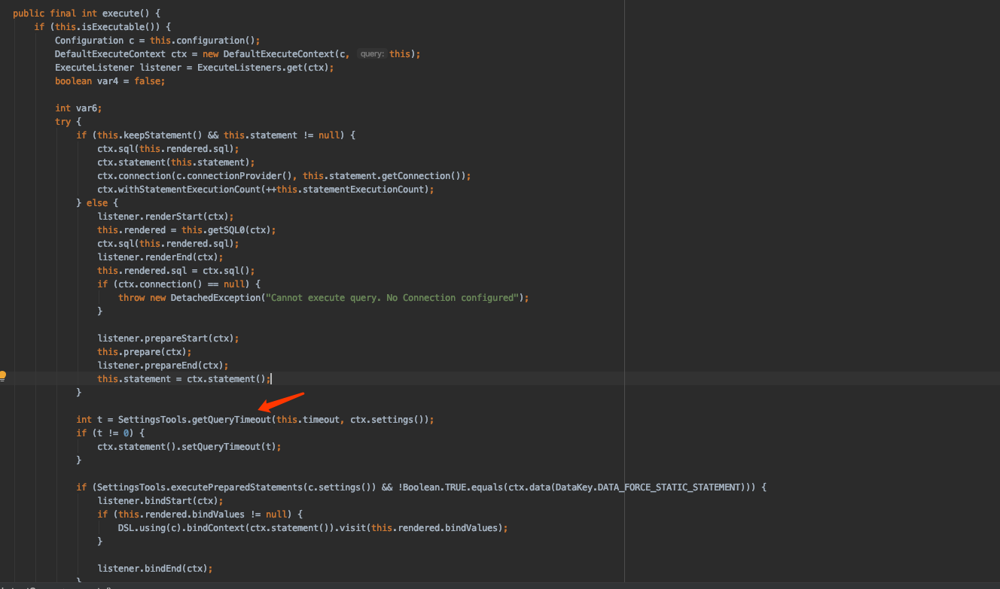

# jooq操作数据库超时处理


## 全局配置超时时间

> https://www.jooq.org/doc/3.13/manual-single-page/#settings-jdbc-flags

```java
@Component
@Configuration
@Slf4j
public class JooqConfig {

    @Autowired
    DSLContext dslContext;

    @PostConstruct
    public void init(){
        dslContext.settings().setQueryTimeout(3);
    }
}
```


## 每个方法自己单独控制



```java
public User retrieve(Long id) {
    List<User> users = dsl.select(USER.ID, USER.NAME, USER.ADDRESS)
      .from(USER)
      .where(USER.ID.eq(id))
       // 优先使用自己设置的超时时间
      .queryTimeout(5)
      .fetch().into(User.class);

    if (users != null && !users.isEmpty()) {
      return users.get(0);
    }
    return null;
}
```


### org.jooq.impl.AbstractQuery#execute() 方法查看



```java
public static final int getQueryTimeout(int timeout, Settings settings) {
	// 优先本次查询设置的timeout，其次才是全局设置的timeout，否则为0
	return timeout != 0 ? timeout : (settings.getQueryTimeout() != null ?  	settings.getQueryTimeout() : 0);
}
```


## org.jooq.ExecuteListener 执行监听器

> 对查询做各种监控操作

```java
@Slf4j
public class PerformanceListener extends DefaultExecuteListener {

    StopWatch watch;

    @Override
    public void executeStart(ExecuteContext ctx) {
        super.executeStart(ctx);
        watch = new StopWatch();
    }

    @Override
    public void executeEnd(ExecuteContext ctx) {
        super.executeEnd(ctx);
        if (watch.split() > 5_000_000_000L)
            log.warn("Slow SQL", "jOOQ Meta executed a slow query"
                            + "\n\n"
                            + "Please report this bug here: "
                            + "https://github.com/jOOQ/jOOQ/issues/new\n\n",
                    new SQLPerformanceWarning());
    }


    /**
     * 在sql语句渲染完成之时调用
     * @param ctx
     */
    @Override
    public void renderEnd(ExecuteContext ctx) {
        if (ctx.sql().matches("^(?i:(UPDATE|DELETE)(?!.* WHERE ).*)$")) {
            throw new DeleteOrUpdateWithoutWhereException();
        }
    }
		

    class SQLPerformanceWarning extends Exception {}

    class DeleteOrUpdateWithoutWhereException extends RuntimeException {}
}
```


```java
// Create a configuration with an appropriate listener provider:
Configuration configuration = new DefaultConfiguration().set(connection).set(dialect);
configuration.set(new DefaultExecuteListenerProvider(new PerformanceListener()));

// Create a DSLContext from the above configuration
DSLContext create = DSL.using(configuration);
```


# mybatis查询超时处理

> https://www.iteye.com/blog/shift-alt-ctrl-2314088
> https://blog.csdn.net/aa283818932/article/details/40379211/


## xml全局配置超时

```xml
<?xml version="1.0" encoding="UTF-8"?>

<!DOCTYPE configuration PUBLIC "-//mybatis.org//DTD  Config 3.0//EN" "http://mybatis.org/dtd/mybatis-3-config.dtd">
<!-- 全局超时配置，300表示sql执行时间超过5分钟时，报错 -->
<configuration>
    <settings>
        <setting name="defaultStatementTimeout" value="300" />
    </settings>
</configuration>


<bean id="sqlSessionFactory" class="org.mybatis.spring.SqlSessionFactoryBean">
    <property name="dataSource" ref="dataSource" />
    <property name="mapperLocations" value="classpath*:config/mybatis/**/mapper_*.xml" />
    <!-- 引入mysql的全局配置，超时，缓存等 -->
    <property name="configLocation" value="classpath:config/mybatis/mysql.xml" />
</bean>

<bean id="sqlSessionTemplate" class="org.mybatis.spring.SqlSessionTemplate">
	<constructor-arg index="0" ref="sqlSessionFactory" />
</bean>
```


## 单独控制，基于xml

当然对于个别情况，有的sql需要执行很长时间或其他的话，可以对单个sql做个性化超时设置。

在mapper xml文件中对具体一个sql进行设置,方法为在select/update/insert节点中配置timeout属性,
依然是以秒为单位.

```xml
<select id="queryList" parameterType="hashmap" timeout="10000">
```


## 结合springboot配置实现

```yaml
mybatis:
  type-aliases-package: com.echo.jooq.model.tables.pojos
  configuration:
    map-underscore-to-camel-case: true
    default-fetch-size: 100
    default-statement-timeout: 3
```


## 单独控制，基于注解实现

```java
@Mapper
public interface UserMapper {

    @Select({"SELECT * FROM User WHERE name = #{name}"})
    @Options(timeout = 3)
    List<User> findByName(@Param("state") String name);
  	
}
```


# JPA中查询超时设置

## JPA全局配置

```yaml
spring:
  application:
    name: spring-jooq
  datasource:
    driver-class-name: com.mysql.cj.jdbc.Driver
    url: jdbc:mysql://mysql.yin.com:3306/test?characterEncoding=utf-8&useSSL=false
    username: root
    password: root
    type: com.zaxxer.hikari.HikariDataSource
    hikari:
      connection-test-query: SELECT 1
      pool-name: EchoHikariPool
      connection-timeout: 10000
      maximum-pool-size: 10
      minimum-idle: 10
      max-lifetime: 10000

  jpa:
    open-in-view: false
    show-sql: true
    database: mysql
    database-platform: org.hibernate.dialect.MySQL5InnoDBDialect
    hibernate:
      ddl-auto: none
    properties:
      # 这种设置，无效
      javax.persistence.query.timeout: 3
#  通过设置事物超时，有效
  transaction:
    default-timeout: 2
```


```java
@Configuration
@Slf4j
public class JPAConfig {
    @Resource
    JpaTransactionManager jpaTransactionManager;

    @PostConstruct
    public void init(){         
        jpaTransactionManager.setDefaultTimeout(3);
    }

}
```


## 查询单独设置

```java
String sql = "SELECT ...";  
TypedQuery<User> query = entityManager.createQuery(sql, User.class);  
query.setParameter("id", id);  

// 单位：毫秒  
query.setHint("javax.persistence.query.timeout", 20000);  
```


# Mysql服务端的查询超时

> https://www.jianshu.com/p/99bafb3a466f
>
> https://blog.csdn.net/sarahcla/article/details/78043501


mysql 5.6 及以后，有语句执行超时时间变量，用于在服务端对 select 语句进行超时时间限制；
mysql 5.6 中，名为： `max_statement_time` （毫秒）
mysql 5.7 以后，改成： `max_execution_time `（毫秒）

超过这个时间，mysql 就终止 select 语句的执行，客户端抛异常：
`Query execution was interrupted, max_execution_time exceeded`

## 三种设置粒度

（1）全局设置
SET GLOBAL MAX_EXECUTION_TIME=1000;

（2）对某个session设置
SET SESSION MAX_EXECUTION_TIME=1000;

（3）对某个语句设置
SELECT max_execution_time=1000 SLEEP(10), a.* from test a;
